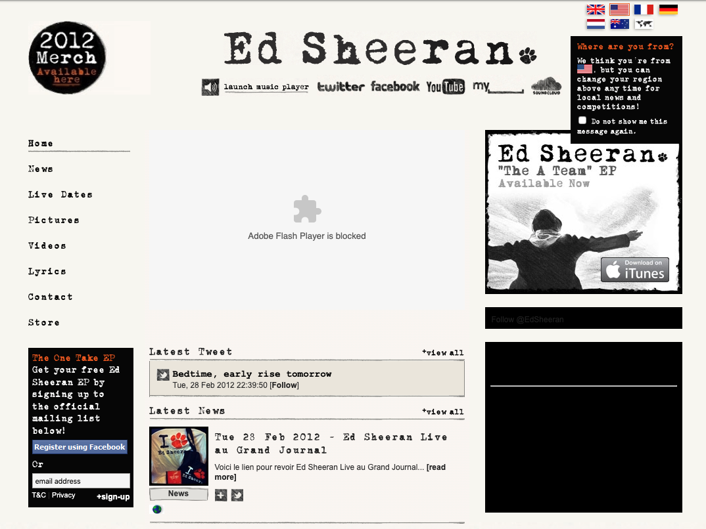

# Meu primeiro site

Eu desenvolvi esse site em 2013 como um trabalho da faculdade, o objetivo era copiar algum site que eu achasse maneiro e eu escolhi esse.

Esse projeto foi utilizado como portfólio preu conseguir meu primeiro emprego (estágio) em 2014.

Eu tentei copiar esse site do Ed Sheeran:

Mas ficou um tanto quanto diferente como da pra ver abrindo o arquivo `app/pag1.html` no browser.
